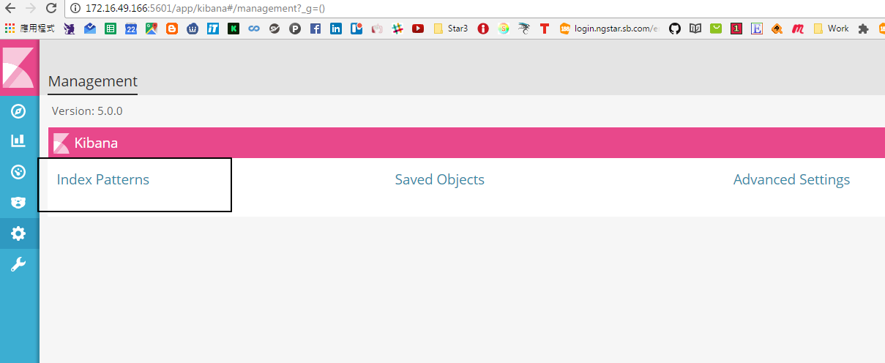
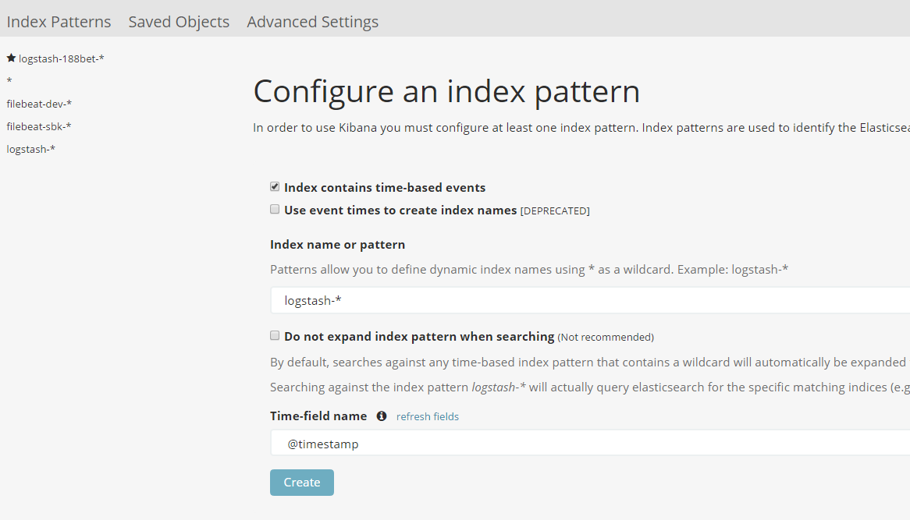
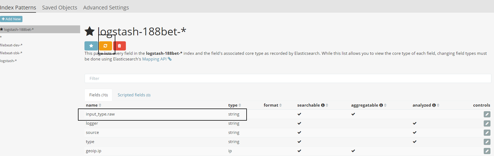

# Kibana Index

在使用Kibana 之前 最重要是先建立Index

**你的Index 永遠都是小寫 **
>因為Index 有可能by week ,date ,month 所以* 的部分代表時間區間 
    

### 當你的 index 內有新增欄位 必須一定要按refresh 欄位 在UI上面才會載入你的欄位資訊   

**下面看到的欄位有.raw 是elk 用來讓你拉dashboard 或是圖表的欄位 切記要用 .raw 欄位來用才有辦法分析**

