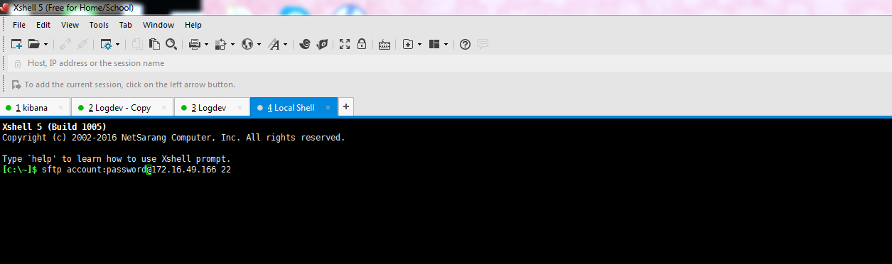

# File Prepare
 

## Download file


* https://www.elastic.co/downloads/elasticsearch
* https://www.elastic.co/downloads/kibana
* https://www.elastic.co/downloads/logstash


## Using sftp to upload file 
Connect from server

upload file to tmp folder /tmp

```lcd d:\ELK``` ()