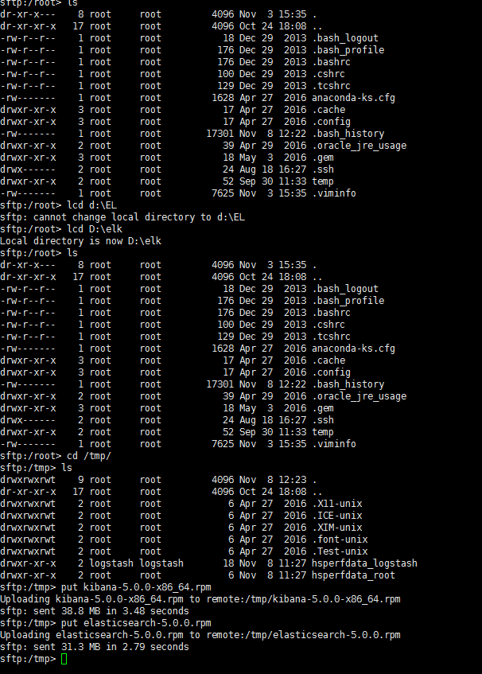

# File Prepare
 

## Download file

* https://www.elastic.co/downloads/elasticsearch
* https://www.elastic.co/downloads/kibana
* https://www.elastic.co/downloads/logstash

## Using sftp to upload file 
Connect from server

> upload file to tmp folder /tmp
>>switch to local disk folder
>>
    lcd elk
>>create a remote folder to temp use   
>>
    mkdir /tmp
>>switch to remote linux folder, if exist   
>>
    cd /tmp
    put elasticsearch-5.0.0.rpm
    put kibana-5.0.0-x86_64.rpm
    put logstash-5.0.0.rpm

## Install JAVA 
1. Please check with rpm is install if not    
       rpm -ivh .rpm

1. Please upload file as Before previous Step

