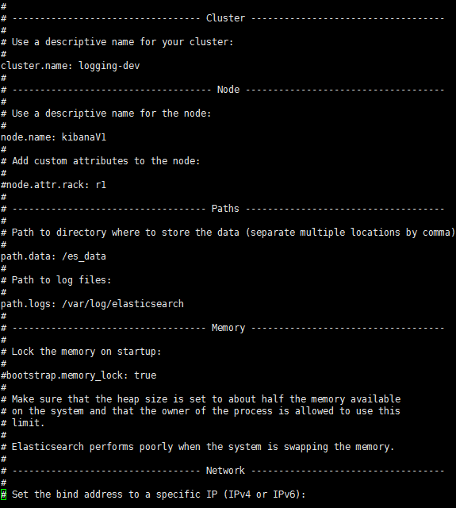

# 2.2 Config Of ElasticSearch

>請先找到相關的路徑 
>通常五版 現在安裝路徑都是在/usr/share/elasticsearch     
>
>如果找不到請用下列指令去尋找

`find / -type d -name 'elasticsearch'`

##Setting Elasticsearch

**請先確認存放資料的folder權限重新安裝或是使用存在資料的folder** 

EX: /es_data    
設定可以寫入的權限
`chmod -R 777 /es_data/`

**如果過去有的資料 會有cluster-name**

這對我們的設定非常重要 

##Elasticsearch 預設 /etc/Elasticsearch/elasticsearch.yml

`vi /etc/elasticsearch/elasticsearch.yml`

>> cluster.name: 如果是升級 請跟過去的folder相同 ex: loggin-dev   
>> node.name: kibanaV1  (請設定唯一)
>> path.data: /es_data (剛剛的folder)
>> network.bind_host: 0.0.0.0 (binding all IP)
>> http.port: 9200 (預設)
>> discovery.zen.ping.unicast.hosts: ["host1", "host2"]  (假設需要設定cluster 才需要 請給其他台的IP)
>> discovery.zen.ping.multicast.enabled: false

`:wq`   

>>>>過去舊版本的用法 (Heap size需要設定 新版本位置可能相同)    
`vi /etc/sysconfig/elasticsearch`   
  Your Elasticsearch data directory
`DATA_DIR=/es_data`   
  Set ES_HEAP_SIZE to 50% of available RAM, but not more than 31g     
`ES_HEAP_SIZE=4g`

`systemctl start elasticsearch`

成功的話可以透過

/var/log/elasticserach 看到log 或是 http://172.16:9200/ 看到輸出的結果

need image

##Elasticsearch Cluster 設定

https://neil-tutorial.blogspot.tw/2016/01/elasticsearch-cluster.html
http://tekibrain.blogspot.tw/2014/08/ubuntu-elasticsearch-cluster.html
設定一樣在
`vi /etc/elasticsearch/elasticsearch.yml`

>增減下列設定   
`node.name: dev-01`   
`node.master: true`   
`node.data: true`   
`http.cors.allow-origin: "*"`   
`http.cors.enabled: true`   

如果有兩台cluster

一定要一台是master node  另外一個是data node

設定可以有這幾種:

* master: true data :true 是master也存放資料
* master: false data :true 單純存放資料
* master: false data:false 單純搜尋
* master: true data: false 單純當master 控制資料流向

設定完以後重啟server他們會自動將cluster裡面的資料做HA:(需要花一點時間)

:wq`   
`systemctl start elasticsearch`
##Elasticsearch Indice

`http://172.16.:9200/_cat/indices`

* yellow: 代表沒有備份到cluster (如果有cluster沒有備份過去請recovery index 或是稍微等待一下)
* green: 代表cluster裡面所有node都有
* red: 代表有問題 需要recovery
`http://172.16.9200/__recovery?logstash-2016.43`

##Elasticsearch 舊版本設定 2.xx

>Setting swap in Elasticsearch Server:
`vi /etc/sysctl.conf`
>>Minimum amount of swapping without disabling it entirely.
`vm.swappiness=1`     
    
    
>Create purge.sh:
  `vi /etc/elasticsearch/purge.sh`
  
  
    #!/bin/sh
    KEEP_WEEK=3
    ELK_DIR=/ELKDB/elasticsearch/nodes/0/indices/
    ELK_URL_AND_PORT=localhost:9200

    KEEP_ARR=()
    i=0
    while [ $i -lt $KEEP_WEEK ]
    do
      KEEP_ARR[$i]=$(date +%Y).`expr $(date +%V) - $i`
      ((i++))
    done
    keep=0
    for name in $(ls $ELK_DIR)
    do
      ((keep = 0))
      for item in ${KEEP_ARR[@]}
      do
        if [[ $name == *"-$item"* ]]; then
          ((keep = 1))
        fi
      done 
      if [[ $keep == 0 ]]; then
        curl -XDELETE "$ELK_URL_AND_PORT/$name"
      fi
    done
    #curl -XDELETE "$ELK_URL_AND_PORT /*metadata*"
    curl "$ELK_URL_AND_PORT /_cat/indices"

>Setting crontab:   
`vi /etc/crontab`
    # Daily purge data at 00:00
    0 0 * * * root /bin/sh /etc/elasticsearch/purge.sh

    