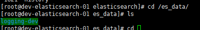

# 2.2 Config Of ElasticSearch

>>請先找到相關的路徑 
>>通常五版 現在安裝路徑都是在/usr/share/elasticsearch     
>>
>>如果找不到請用下列指令去尋找

`find / -type d -name 'elasticsearch'`

##Setting Elasticsearch

**請先確認存放資料的folder權限重新安裝或是使用存在資料的folder** 

EX: /es_data    
設定可以寫入的權限
`chmod -R 777 /es_data/`

**如果過去有的資料 會有cluster-name**

這對我們的設定非常重要 

##Elasticsearch 預設 /etc/Elasticsearch/elasticsearch.yml

`vi /etc/elasticsearch/elasticsearch.yml`

>> cluster.name: 如果是升級 請跟過去的folder相同 ex: loggin-dev
    