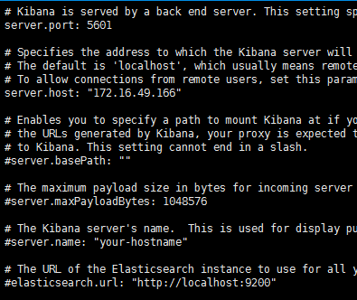
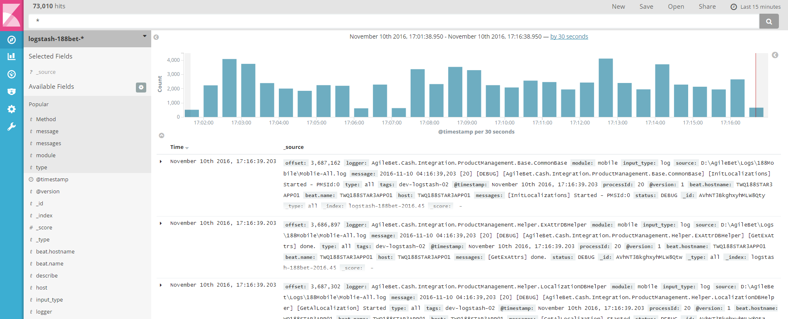

# 2.3 Config Of Kibana

>請先找到相關的路徑 
>通常五版 現在安裝路徑都是在/usr/share/kibana     
>
>如果找不到請用下列指令去尋找

`find / -type d -name 'kibana'`

##kibana 預設 /etc/kibana/kibana.yml
`vi /etc/elasticsearch/elasticsearch.yml`
>server.port:5601
>server.host: 設定server ip
>elasticsearch.url: 如果不是同一台請修改 url   

`:wq` save file

`systemctl start kibana`   
理論上在 就可以看到畫面
>http://172.16.49.166:5601/

##kibana 舊版本設定

**Register Kibana in systemctl:**
> vi /etc/systemd/system/kibana.service   

      [Unit]
      Description=Kibana

      [Service]
      ExecStartPre=rm -rf /var/run/kibana.pid
      ExecStart=/opt/kibana/bin/kibana
      ExecReload=/bin/kill -9 $(cat /var/run/kibana.pid) && rm -rf /var/run/kibana.pid && /opt/kibana/bin/kibana
      ExecStop=/bin/kill -9 $(cat /var/run/kibana.pid)
      [Install]
      WantedBy=multi-user.target

**Setting Kibana:**

> vi /opt/kibana/bin/kibana
        # Add below before exec:
        # Always perform global GCs
        NODE_OPTIONS="$NODE_OPTIONS --gc_global "
        # Max size of the heap memory (MB), 1400Mb default on 64 bit.
        NODE_OPTIONS="$NODE_OPTIONS --max-old-space-size=4096 "

