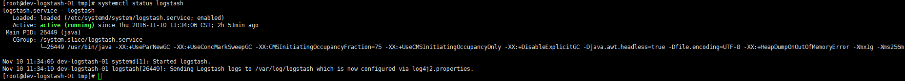
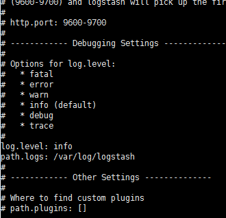

# 2.1 Config Of Logstash

>>請先找到相關的路徑 
>>通常五版 現在安裝路徑都是在/usr/share/logstash     
>>
>>如果找不到請用下列指令去尋找

    find / -type d -name 'logstash' 
    
確定後請下(啟動logstash)

    systemctl start logstash    
如果發現logstash.service 沒有被enable，請先把他enable 起來

    systemctl enable application.service  

停止service    
     
    systemctl start logstash    
## logstash 預設會先抓/etc/logstash/conf.d 的config檔案
**請務必先放預設的conf 檔案**

>> 使用這個結構 10. input  && 30.output 是一定必要的檔案 代表輸出跟輸入   請先放入設定的檔案 詳細在logstash 設定會寫

## logstash 預設會先抓/etc/logstash/logstash.yml

如果不知道的話 可以用查看他預設的路徑

    vi /etc/systemd/system/logstash.service 
    
基本上不需要調整任何的設定 除非你有檔案要修改 

EX: 你想要讓logstash 使用debug模是觀看你的pattern 設定

     vi /etc/logstash/logstash.yml
     修改 log.level:debug 
存檔請下指令，接著重啟SERVICE

    :wq
    systemctl restart logstash         

接著你應該會在/var/log/lostash/內看到log，正確啟動都會有寫出

Config請參考

https://www.elastic.co/guide/en/logstash/current/configuration-file-structure.html
## 五版logstash 的Geocity.dat 判斷區域IP位置已經取消了 千萬不要再把檔案放入