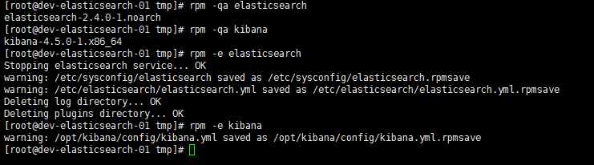

# Windows Version

## Install of JAVA 
Add Envirement Vars
> please make sure the folder with server and JVM DLL

```
JAVA_HOME= "C:\Program Files\Java\jre1.8.0_131"

Path += "C:\Program Files\Java\jre1.8.0_131\bin"
```


##Install of ElasticSearch
>install guide 
https://www.elastic.co/guide/en/elasticsearch/reference/current/windows.html

  


##Install of Logstash

https://www.elastic.co/guide/en/beats/libbeat/current/logstash-installation.html
https://www.elastic.co/guide/en/logstash/current/running-logstash-command-line.html

###Extract folder 

###put the config in CustomConfig folder

>save as default.conf 


```
 input {
 
    beats {
                 port => 5044
         }
 }
 
 filter {
 	
 		grok {
 			match => { "message" => "%{TIMESTAMP_ISO8601:log_timestamp}"}
 		}
 		date {
 			match => [ "log_timestamp", "ISO8601"]
 			target => "@log_timestamp"
 		}
 }
 
 output {
   elasticsearch {
     hosts => ["http://localhost:9200"]
     index => "logstash-%{+xxxx.ww}"
     document_type => "%{[@metadata][type]}"
    }
 }

```


register as service

Download nssm

http://nssm.cc/download

**cmd as admin **

nssm install logstash "E:\Logstash\logstash-5.5.0\bin\logstash.bat" "-f :\Logstash\logstash-5.5.0\CustomConfig -r "


nssm start logstash


## Install of Filebeat

### Extract Folder

### Create bat file 

>remove old version then install.bat

```
%SystemRoot%\system32\WindowsPowerShell\v1.0\powershell.exe -Command "set-executionpolicy unrestricted"
%SystemRoot%\system32\WindowsPowerShell\v1.0\powershell.exe -Command "&{stop-service filebeat}"
%SystemRoot%\system32\WindowsPowerShell\v1.0\powershell.exe -Command "& 'E:\filebeat-5.4.3-windows-x86_64\uninstall-service-filebeat.ps1'"

%SystemRoot%\system32\WindowsPowerShell\v1.0\powershell.exe -Command "&{E:\filebeat-5.4.3-windows-x86_64\install-service-filebeat.ps1}"
%SystemRoot%\system32\WindowsPowerShell\v1.0\powershell.exe -Command "Set-Service filebeat -startuptype "manual""
%SystemRoot%\system32\WindowsPowerShell\v1.0\powershell.exe -Command "&{start-service filebeat}"

cd E:\filebeat-5.4.3-windows-x86_64
E:

pause
```


# Linux Version

Please Use SSH and Use Root to Login and Install
```
sftp account:password@ip 22

```

**Please know That Logstash and ElasticSearch Should not install in the same server, they need CPU for I/O**

**Please know that this is for no network using**

## Install of Logstash

```
cd /tmp
rpm -ivh logstash-5.0.0.rpm
```

## Install of ElasticSearch

```
cd /tmp
rpm -ivh elasticsearch-5.0.0
```

## Install of Kibana

```
cd /tmp
rpm -ivh kibana-5.0.0-x86_64.rpm
```

> > rpm -qa logstash  代表 查詢目前的版本
> >
> > rpm -e logstash 代表 移除套件



## Upgrade of Logstash
```
cd /tmp
rpm -Uvh logstash-5.2.2.rpm
```

新增完成後

會有一個rpmnew 檔案 需要比較設定是否跟舊版本相同


## Upgrade of ElasticSearch

```
cd /tmp
rpm -Uvh elasticsearch-5.0.0
```

>Please Make sure the Kibana is the Same version of ElasticSearch
>ElasticSearch 如果沒辦法啟動 請先檢查 /var/log/ElasticSearch 裡面的log
>接著檢查設定檔是否有設定需要調整

###五版以後Elastic & Kibana 必須一起升級


