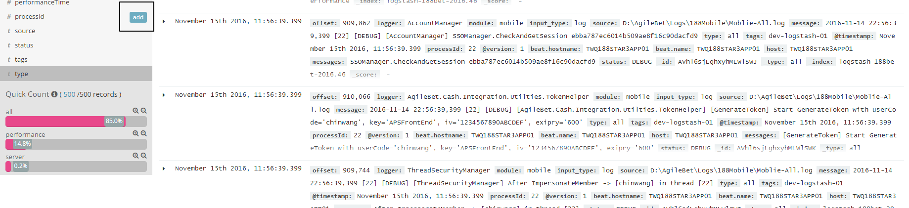
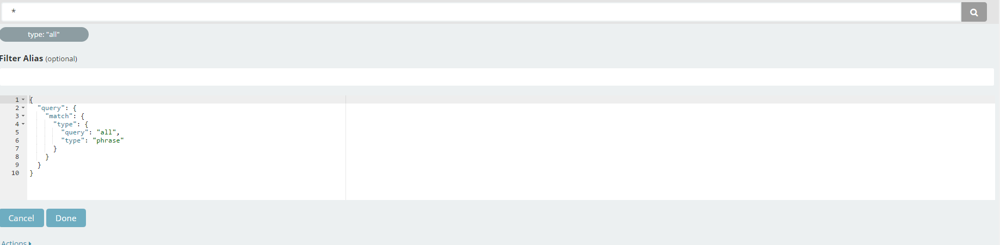

# Kibana Search Setting

Please go to Discover Tab first

## Save Search 

一開始你需要存一個簡易的Search 你可以透過左側的 欄位 去加上你想要顯示的欄位 

> Type: 在elasticsearch = DB 
> 展開Type field ,裡面有最近500的值 **點+ 或是-** 代表加上此filter + 代表 符合此條件 - 代表不要包含此條件   

      
移動上去filter   會顯示一些條件，可以再度調整，點最右邊的條件可以修改你要的條件
   
可以修改你所需要的條件  

