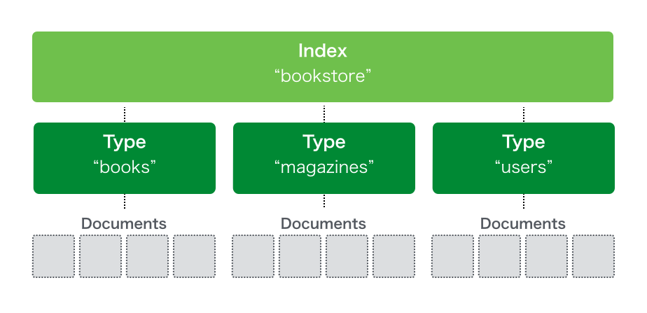
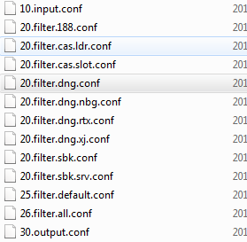

#Logstash Pattern 簡單教學

請參考   
https://www.elastic.co/guide/en/logstash/current/configuration-file-structure.html

簡單對存入進去es的資料做一些講解    
* index => DB
* type => Table
* document => 剩下的檔案

基礎 由 三塊組合而成
* input    
* filter    
* output     

因為各個Team 的filter條件大部分都不一樣 所以透過編號的方法 讓他區分開

logstash 在啟動的時候會在去將這些檔案合併，所以請依照數字排序 不要讓config出問題

有問題可以從log 看

#input 

>mutiline 如果沒有放在這個區域他沒辦法啟動 多執行緒去判別
>port => 進入的port
> mutiline 判斷ISO 8601 或是 ISO 8601後面時間區碼是7碼 將他多行合併成一行

      input {

         beats {
              port => 5044
              codec => multiline {
              pattern => "^[0-9]{4}-[0-9]{2}-[0-9]{2} [0-9]{2}:[0-9]{2}:[0-9]{2}[\.,][0-9]{3,7} "
              negate => true
              what => "previous"
              }
          }
      }

#filter
測試自己的pattern 可以先從下面兩個網址去查詢

https://grokdebug.herokuapp.com/   
http://grokconstructor.appspot.com/do/match

>[@metadata][beat] 這個是從你的filebeat 設定檔案的index 來的 他可以取不同的名子 **切記要小寫**    
>grok 代表他會match什麼樣的條件 會依照match的順序    
>break_on_match => true 代表只要符合他就會跳掉    
>%{TIMESTAMP_ISO8601:logDate}  TIMESTAMP_ISO8601 代表他內建的條件 : 後面是你想要的欄位名稱    
>%{POSINT:processId:int} 最後可以指定他的型態    
>(?&lt;logger>[A-Z\-a-z .]+) 如果想自定pattern 格式 可以透過 [內的regular expression]去撰寫    

基本設定

      filter {
          if  [@metadata][beat] =~ "188bet"   {

              grok {		
                  break_on_match => true
                  match => {"message" => "%{TIMESTAMP_ISO8601:logDate} (\[%{POSINT:processId:int}\]) \[(?<status>(INFO|DEBUG|WARNING|ERROR))\] \[(?<logger>[A-Z\-a-z .]+)\] \[(?<PERFORMANCE>[A-Z\-a-z]+)\]\[(?<describe>[A-Z\-a-z  ]+)\]\[(?<Method>[A-Z\-a-z . /=?0-9\[\]:()',]+)\]\[%{NUMBER:performanceTime:int}ms\]%{GREEDYDATA:messages}"}
                  match => {"message" => "%{TIMESTAMP_ISO8601:logDate} (\[%{POSINT:processId:int}\]) \[(?<status>(INFO|DEBUG|WARNING|ERROR))\] \[(?<logger>[A-Z\-a-z .]+)\]\[(?<webapi>[A-Z\-a-z]+)\]\[(?<apiPath>[A-Z\-a-z . /=?0-9\[\]:()]+)\]\[(?<httpMethod>[A-Z\-a-z /.\-]+)\]\[%{IP:clientIP}\]%{GREEDYDATA:messages}"}
                  match => {"message" => "%{TIMESTAMP_ISO8601:logDate} (\[%{POSINT:processId:int}\]) \[(?<status>(INFO|DEBUG|WARNING|ERROR))\] \[(?<logger>[A-Z\-a-z .]+)\] \[(?<Feature>(FEATURE))\]\[(?<Method>[A-Z\-a-z . /=?0-9:()]+)\]\[(?<featureResult>[A-Z\-a-z . /=?0-9:()]+)\]%{GREEDYDATA:messages}"}
                  match => {"message" => "%{TIMESTAMP_ISO8601:logDate} (\[%{POSINT:processId:int}\]) \[(?<status>(INFO|DEBUG|WARNING|ERROR))\] \[(?<logger>[A-Z\-a-z .]+)\] %{GREEDYDATA:messages}"}
                  match => {"message" => "%{TIMESTAMP_ISO8601:logDate} (\[%{POSINT:processId:int}\]) (?<status>(INFO|DEBUG|WARN|ERROR))"}
              }
              # customize timestamp
              date {
                  timezone => "America/Toronto"
                  match => ["logDate", "ISO8601"]
                  target => "@timestamp"
              }	
              mutate {
                      convert => [ "[geoip][coordinates]", "float"]
                      remove_tag => [ "beats_input_codec_plain_applied", "beats_input_codec_multiline_applied", "_grokparsefailure" ]
                      remove_field => [ "PERFORMANCE","logDate","Feature" ,"webapi" ]
              }

              if [httpMethod]{
                  mutate {
                      add_tag => [ "%{httpMethod}" ,"%{apiPath}" ]
                  }	

              }
              if [Method]{
                  mutate {
                      add_tag => [ "%{Method}"  ]
                  }	
              }
              if [featureResult]{
                  mutate {
                      add_tag => [ "%{featureResult}"  ]
                  }	
              }

              if [clientIP] {
                  geoip {
                        source => "clientIP"
                        target => "geoip"
                        # database => "/etc/logstash/GeoLiteCity.dat"
                        add_field => [ "[geoip][coordinates]", "%{[geoip][longitude]}" ]
                        add_field => [ "[geoip][coordinates]", "%{[geoip][latitude]}"  ]
                  }
              }

          }
      }

