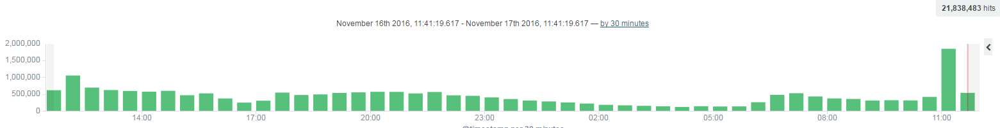

# Performance Setting

##Input log with Mutiline

*  Mutipleline in logstash input   

>優點：統一input 可以開mutithread      
>缺點：如果量很大可能會影響logstash cpu 用量 ，input 從filebeat 來還是需要一行一行合併　可能會造成效能問題

      input {
         beats {
            port => 5044
            codec => multiline {
            pattern => "^[0-9]{4}-[0-9]{2}-[0-9]{2} [0-9]{2}:[0-9]{2}:[0-9]{2}[\.,][0-9]{3,7} "
            negate => true
            what => "previous"
            }
            congestion_threshold  => 40
           }
        }

* Mutipleline in logstash filter 

>優點：分開設定在filter 內   
>缺點：如果量很大可能會影響logstash cpu 用量，不能開mutithread ，變成一定要一行一行進去才能收集　是最不好的方法　　　　

        filter {
            if  [@metadata][beat] =~ "188bet"   {
                  multiline {
                   pattern => "^%{TIMESTAMP_ISO8601}"
                   negate => true
                   what => "previous"
                }
          }
        }
* Mutipleline in filebeat    

>優點:　各自由filebeat　送log 到 logstash , 減少logstash cpu     
>缺點：可能會影響原本server cpu,mem

**下列設定是by各個要撈的檔案　**

        - input_type: log
          paths:
            - D:\AgileBet\Logs\MobileApp\*-ERROR.log
          document_type: apperror	  
          multiline.pattern: '^[0-9]{4}-[0-9]{2}-[0-9]{2} [0-9]{2}:[0-9]{2}:[0-9]{2} '
          multiline.negate: true
          multiline.match: after
##Performance Compare note.
Server : 18 (other team have total 20 or more)
###using Mutipleline in logstash input  
>30 scends : 2000~4000  ,lost 90%   
>we have 3 team to deploy the 4 logstash server with 2 es server.

>Server filebeat have 300 mem, seems stock in server side 

###using Mutipleline in filebeat   

>30 scends : 30000

>Server filebeat have 20 mem, s

