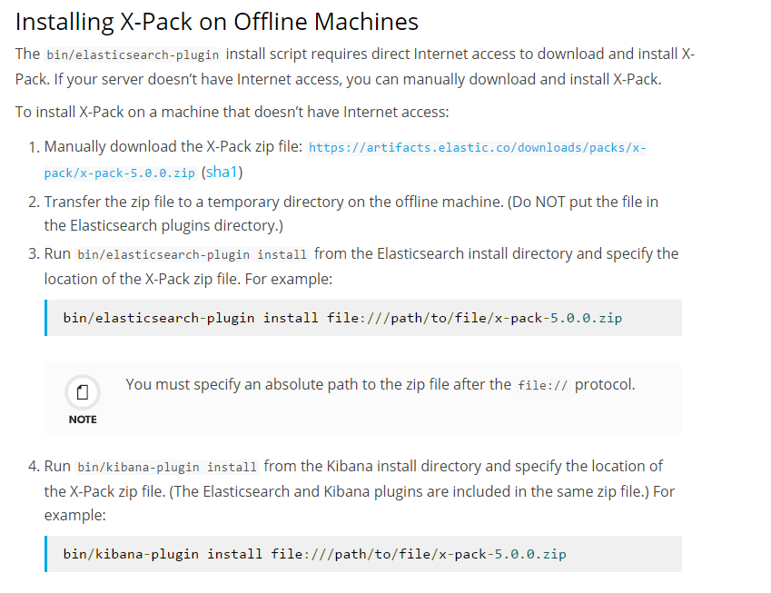
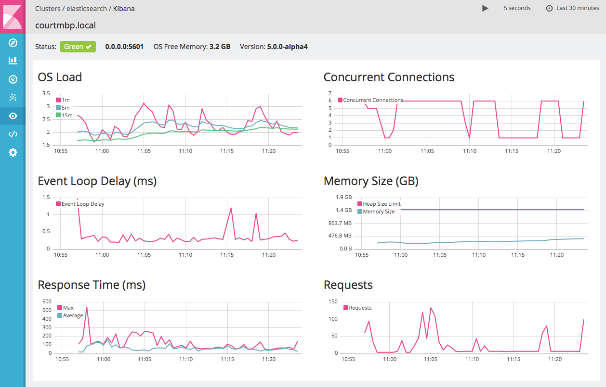

# 2.4 Plugin Install Of All Module

## X-pack 
> 此套件試用一個月 基本功能有 觀測Index 效能、搜尋時間 、新增使用者權限   
> **他需要安裝在Kibana ,elasticsearch**上面   
https://www.elastic.co/downloads/x-pack   

安裝如下:

請先把檔案上傳到Server上 並且下指令去安裝   
`/usr/share/elasticsearch/bin/elasticsearch-plugin install file:///tmp/x-pack-5.0.0.zip`    

`/usr/share/kibana/bin/kibana-plugin install file:///tmp/x-pack-5.0.0.zip`

設定完成後一定打不開 因為預設elasticsearch 權限是有權限的

請編輯設定檔案   
`vi /etc/elasticsearch/elasticsearch.yml`
>加入以下設定   
>`xpack.security.enabled: false`

安裝好了後重啟兩個service就會在畫面上面看到 這些設定

## 離線安裝設定
>此版本為2.X.X 指令 可以透過檔案路徑下安裝指令

`bin/plugin install lmenezes/elasticsearch-kopf -url file:///usr/share/elasticsearch/elasticsearch-kopf-master.zip `